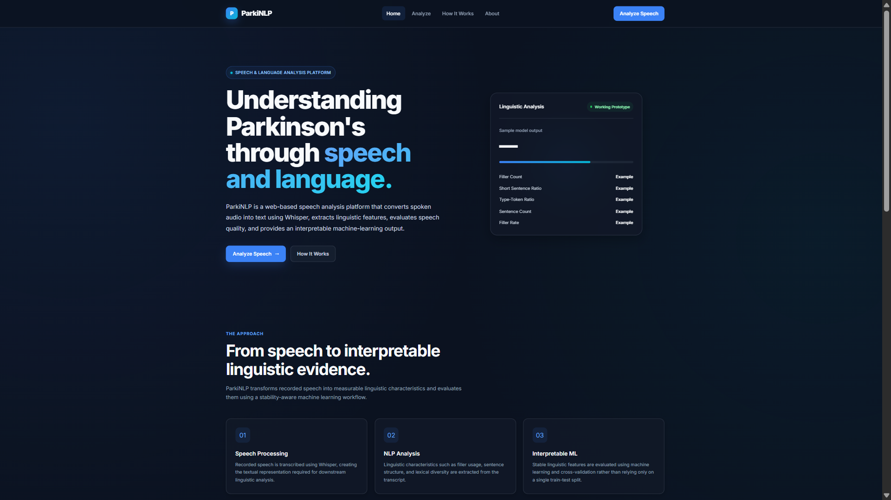
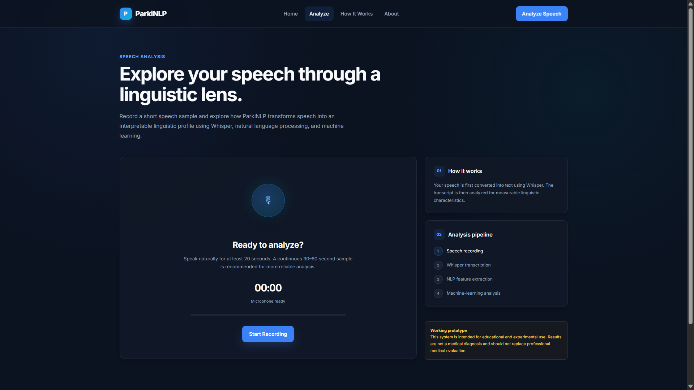
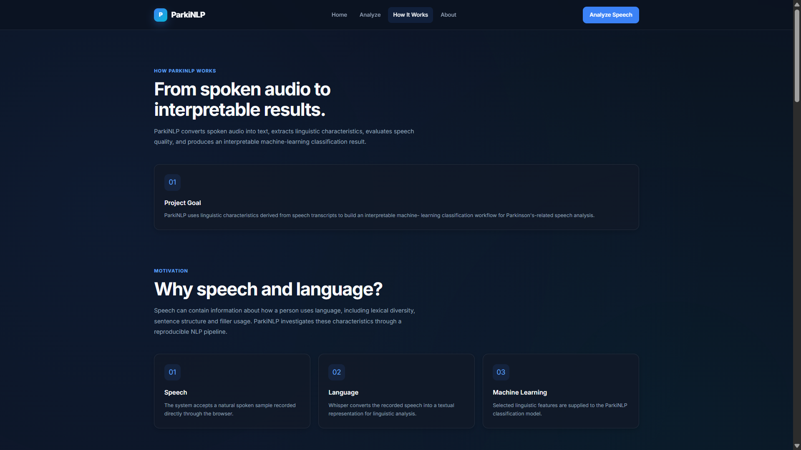
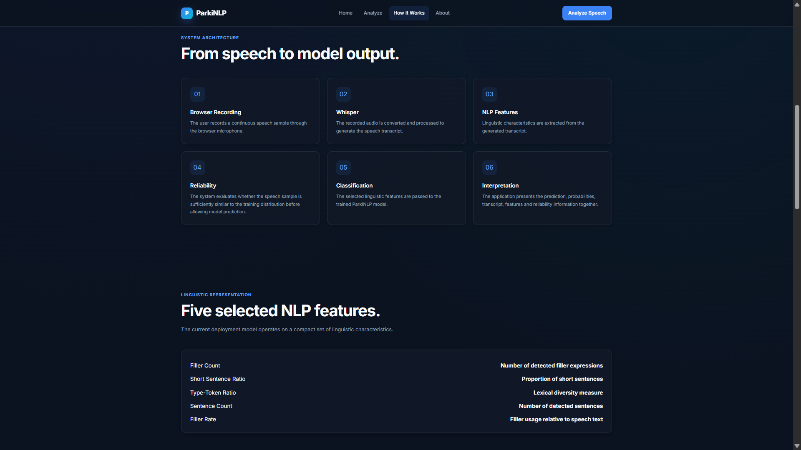
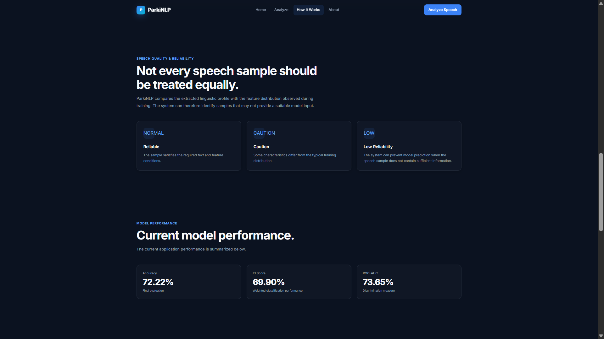

# ParkiNLP

ParkiNLP is a web-based speech analysis application that converts spoken audio into text using Whisper, extracts linguistic features using NLP, evaluates speech-sample reliability, and produces an interpretable machine-learning classification result.

## Key Features

- Browser-based microphone recording
- 20–60 second recording workflow
- Automatic audio processing and conversion
- Whisper-based speech-to-text transcription
- NLP-based linguistic feature extraction
- Speech-sample reliability assessment
- Reliability-aware classification handling
- HC and PD class probabilities
- Interactive results dashboard
- Transcript and linguistic-feature visualization
- Pipeline status visualization
- Analyze Another Recording workflow
- Browser microphone and analysis error handling
- Responsive web interface

## Screenshots

### Home


### Speech Analysis


### How It Works






## What Makes ParkiNLP Different

ParkiNLP is designed as a complete speech-to-analysis workflow rather than a standalone machine-learning model.

The system first converts speech into text, extracts a compact set of interpretable linguistic features, evaluates whether the resulting linguistic profile is suitable for model interpretation, and then presents the classification output through an interactive web interface.

This reliability-aware layer allows the application to distinguish between:

- Reliable speech samples
- Cautionary speech samples
- Low-reliability speech samples

Instead of blindly displaying a classification result for every input, the system can provide a caution state or withhold model interpretation when the speech sample is not sufficiently suitable.

## How It Works

```text
Browser Microphone
        ↓
Audio Recording
        ↓
WebM → WAV Conversion
        ↓
Whisper Transcription
        ↓
NLP Feature Extraction
        ↓
Speech-Sample Reliability Assessment
        ↓
Machine-Learning Classification
        ↓
Interactive Results Dashboard

```
## NLP Features

The current classification pipeline uses five selected linguistic features:

- Filler Count
- Filler Rate
- Sentence Count
- Short Sentence Ratio
- Type-Token Ratio

These features provide a compact and interpretable representation of the speech transcript.

## Reliability System

The reliability layer compares the extracted linguistic profile with the expected feature distribution used by the model.

### Reliable

The speech sample provides sufficiently consistent linguistic information for model interpretation.

### Caution

The speech sample can be analyzed, but some linguistic characteristics differ from the expected training distribution.

### Low Reliability

The speech sample does not provide sufficiently reliable information for interpretation, so the classification output can be withheld.

## Technology Stack

### Backend
- Python
- Flask
### Speech Processing
- OpenAI Whisper
- FFmpeg
### Natural Language Processing
- spaCy
- Pandas
### Machine Learning
- scikit-learn
- Joblib
- PyTorch
### Frontend
- HTML
- CSS
- JavaScript

## Project Structure
```text

ParkiNLP/
│
├── app.py
├── requirements.txt
├── README.md
├── .gitignore
│
├── models/
│   └── parkinlp_model.joblib
│
├── src/
│   ├── whisper_service.py
│   ├── extract_text_features.py
│   ├── reliability_service.py
│   ├── prediction_service.py
│   └── supporting training, evaluation,
│       testing, analysis, and visualization scripts
│
├── templates/
│   ├── base.html
│   ├── index.html
│   ├── analyze.html
│   ├── research.html
│   └── about.html
│
└── static/
    ├── css/
    │   └── style.css
    └── js/
        └── main.js

```
## Installation
### 1. Clone the Repository
```bash
git clone https://github.com/Kundanika238/ParkiNLP.git
cd ParkiNLP
```
### 2. Create a Virtual Environment
```bash
python -m venv .venv
```
Activate it:
```bash
.venv\Scripts\Activate.ps1
```
### 3. Install Python Dependencies
```bash
pip install -r requirements.txt
```
### 4. Install FFmpeg

ParkiNLP uses FFmpeg for audio conversion.

Verify the installation with:
```bash
ffmpeg -version
```
FFmpeg must be available through the system PATH.

### 5. Run the Application
```bash
python app.py
```
Open:
```bash
http://127.0.0.1:4000
```
## How to Use
1. Open the Analyze page.
2. Allow microphone access.
3. Record a natural speech sample.
4. A continuous sample of approximately 30–60 seconds is recommended.
5. Stop the recording.
6. Review the audio preview.
7. Click Analyze Speech.
8. Review the transcript, linguistic features, reliability status, and classification output.

## Model Output
The application can display:
- Classification result
- HC probability
- PD probability
- Reliability status
- Unusual linguistic features
- Transcript
- Linguistic feature values
- Processing pipeline status

The displayed HC/PD values represent model class probabilities and should not be interpreted as clinical probabilities.

## Dataset

The current application uses a structured speech dataset containing:

- 21 healthy-control recordings
- 15 Parkinson's-related recordings
- 36 total recordings
- 36 unique participants

The raw speech recordings and participant transcripts are not included in the public repository.

## Model

The repository includes the lightweight deployment model:
```bash
models/parkinlp_model.joblib
```
The model is loaded directly by the Flask application during startup.

## Model Performance

The current application includes an evaluation snapshot with:

- Accuracy: 72.22%
- F1 Score: 69.90%
- ROC-AUC: 73.65%

These values describe the current model evaluation and should not be interpreted as clinical performance.

## Responsible Use

ParkiNLP is an experimental speech-analysis application intended for educational and experimental use.

Its output is not a medical diagnosis and should not be used to make medical decisions or replace evaluation by a qualified healthcare professional.

## Future Improvements
- Larger and more diverse speech datasets
- Additional linguistic and speech-derived features
- Model calibration improvements
- External validation
- Additional model comparisons
- Multilingual speech support
- More robust production deployment
- Extended analytics and reporting

## Project Status

ParkiNLP is a working end-to-end software project integrating browser-based speech capture, automatic transcription, NLP feature extraction, reliability-aware analysis, and machine-learning classification.
  
